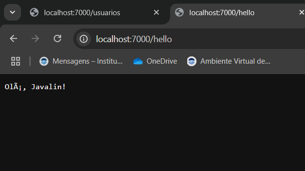

Projeto API RESTful com Javalin, Gradle e JUnit (Sistema de Gerenciamento de Usuários e Tarefas)

OBJETIVO
Este projeto consiste no desenvolvimento de uma API RESTful em Java, utilizando o framework Javalin, focando em clareza, manutenibilidade e qualidade de código. O sistema permite o gerenciamento de Usuários e Tarefas, oferecendo funcionalidades completas de criação, leitura, atualização e exclusão (CRUD).

Tecnologias Utilizadas
- Java 21: Linguagem de programação principal.
- Javalin 6.1.3: Framework web leve e eficiente para criação de APIs REST.
- Gradle: Ferramenta de automação de build.
- Unit 5: Framework para testes unitários.
- Javalin Testtools: Auxiliares para testar aplicações Javalin de forma isolada.
- OkHttp: Cliente HTTP para testes de integração.
- Jackson (jackson-databind): Biblioteca para serialização e desserialização de JSON.
- SLF4J Simple: Implementação de logger simples para visualização de logs.
- HttpURLConnection: Classe nativa do Java utilizada para consumo da API no ApiClient.java.

ESTRUTURA DO PROJETO
O projeto segue uma arquitetura modular, baseada em princípios de separação de responsabilidades (Model-Service-Controller), para garantir maior organização, manutenibilidade e testabilidade.

novo_at1/
|-- build.gradle.kts          # Configurações do Gradle e dependências
|-- src/
|   |-- main/
|   |   |-- java/
|   |       -- app/
|   |           |-- App.java          # Classe principal da aplicação (configura o Javalin e registra os controllers)
|   |           |-- client/           # Pacote para o cliente Java que consome a API
|   |           |      |-- ApiClient.java
|   |           |-- controller/       # Pacote para os controladores (endpoints HTTP)
|   |           |      |-- TarefaController.java
|   |           |      |-- UsuarioController.java
|   |           |-- model/            # Pacote para os modelos de dados (POJOs)
|   |           |     |-- Tarefa.java
|   |           |     |-- Usuario.java
|   |           |-- service/          # Pacote para as lógicas de negócio e manipulação de dados
|   |                 |-- TarefaService.java
|   |                 |-- UsuarioService.java
|   |-- test/
|         |-- java/
|               |-- app/
|                     |-- AppTest.java      # Classe de testes unitários
|-- docs/                                   # Pasta para documentação e imagens
|     |-- images/                           # Subpasta para armazenar os prints de tela
|-- README.md                               # Este arquivo!

Como Rodar o Projeto
Pré-requisitos: 
- Java Development Kit (JDK) 21 ou superior. 
- Opcional, mas recomendado para testes manuais da API Postman.

CONSTRUINDO (COMPILANDO) O PROJETO:
Para compilar o projeto e baixar todas as dependências, executei o seguinte comando na raiz do projeto (C:\Users\Grazielli\IdeaProjects\novo_at1):

.\gradlew clean build --rerun-tasks

clean: Remove quaisquer builds anteriores.

build: Compila o código-fonte, executa os testes e empacota a aplicação.

--rerun-tasks: Garante que todas as tarefas sejam executadas do zero.

Você deverá ver BUILD SUCCESSFUL ao final da execução.

 EXECUTANDO A API (Servidor Javalin)
Para iniciar o servidor Javalin, execute o comando na raiz do projeto:

.\gradlew run

A API será iniciada na porta 7000.

Mantenha este terminal aberto enquanto estiver testando a API.

 EXECUTANDO TESTES UNITARIOS
Para executar a suíte completa de testes unitários (todos os testes em AppTest.java), execute na raiz do projeto:

.\gradlew test --rerun-tasks

Você deverá ver BUILD SUCCESSFUL e um resumo dos testes aprovados no terminal.

Um relatório HTML detalhado dos testes pode ser encontrado em: build/reports/tests/test/index.html (abra este arquivo no seu navegador).

EXECUTANDO O CLIENTE JAVA (ApiClient)
Para testar o cliente Java (ApiClient.java) que consome sua API:

Primeiro, certifique-se de que sua API está rodando em um terminal separado (usando .\gradlew run).
Em outro terminal novo, navegue até a raiz do projeto e execute:
.\gradlew runClient

Este comando executará o main da classe ApiClient, que fará requisições POST e GET para sua API e imprimirá as respostas no console.

ENDPOINTS DA API
A API expõe os seguintes endpoints, CRUD completo, para Usuários e Tarefas:

-- Endpoints Gerais --
-GET /hello
Descrição: Retorna uma mensagem de saudação simples.

-GET /status
Descrição: Retorna o status da aplicação e a hora atual.

-POST /echo
Descrição: Recebe um JSON e o retorna como resposta.

-GET /saudacao/{nome}
Descrição: Retorna uma mensagem de saudação personalizada.

ENDPOINTS DE USUARIO(CRUD)
-Modelo Usuario:

{
    "nome": "string",
    "email": "string (único, obrigatório)",
    "idade": "int"
}

-POST /usuarios
Descrição: Cria um novo usuário.

Erros:
400 Bad Request: "Email é obrigatório" (se email for nulo/vazio).
409 Conflict: "Usuário já existe" (se email já estiver em uso).
400 Bad Request: "JSON mal-formado ou formato de dados inválido."

-GET /usuarios
Descrição: Lista todos os usuários cadastrados.

-GET /usuarios/{email}
Descrição: Busca um usuário pelo email.

Erro (404 Not Found): "Usuário não encontrado" (se o email não existir).

-PUT /usuarios/{email}
Descrição: Atualiza completamente um usuário existente. O email no path deve corresponder ao email no corpo, ou o email no corpo se tornará o novo email do usuário.

Resposta (200 OK): Retorna o JSON do usuário atualizado.

Erros:
400 Bad Request: "Email é obrigatório" ou "Novo email já está em uso por outro usuário."
404 Not Found: "Usuário não encontrado para atualização."
400 Bad Request: "JSON mal-formado ou formato de dados inválido."

DELETE /usuarios/{email}
Descrição: Exclui um usuário pelo email.

Erro (404 Not Found): "Usuário não encontrado para exclusão."

ENDPOINTS DE TAREFAS (CRUD)
Modelo Tarefa:

{
    "id": "int (gerado automaticamente se 0/omitido)",
    "titulo": "string (obrigatório)",
    "descricao": "string (opcional)",
    "concluida": "boolean"
}

-POST /tarefas
Descrição: Cria uma nova tarefa. O id é gerado automaticamente.

Resposta (201 Created): Retorna o JSON da tarefa criada (com id gerado).

Erros:
400 Bad Request: "Título é obrigatório" (se título for nulo/vazio).
400 Bad Request: "JSON mal-formado ou formato de dados inválido."

-GET /tarefas
Descrição: Lista todas as tarefas cadastradas.

-GET /tarefas/{id}
Descrição: Busca uma tarefa pelo ID.

Resposta (200 OK): Retorna o JSON da tarefa encontrada.

Erros:
400 Bad Request: "ID inválido" (se o ID no path não for um número).
404 Not Found: "Tarefa não encontrada" (se o ID não existir).

-PUT /tarefas/{id}
Descrição: Atualiza completamente uma tarefa existente pelo ID.

Resposta (200 OK): Retorna o JSON da tarefa atualizada.

Erros:
400 Bad Request: "ID inválido" (se o ID no path não for um número).
400 Bad Request: "Título é obrigatório".
404 Not Found: "Tarefa não encontrada para atualização."
400 Bad Request: "JSON mal-formado ou formato de dados inválido."

- DELETE /tarefas/{id}
Descrição: Exclui uma tarefa pelo ID.

Erros:
400 Bad Request: "ID inválido" (se o ID no path não for um número).
404 Not Found: "Tarefa não encontrada para exclusão."
